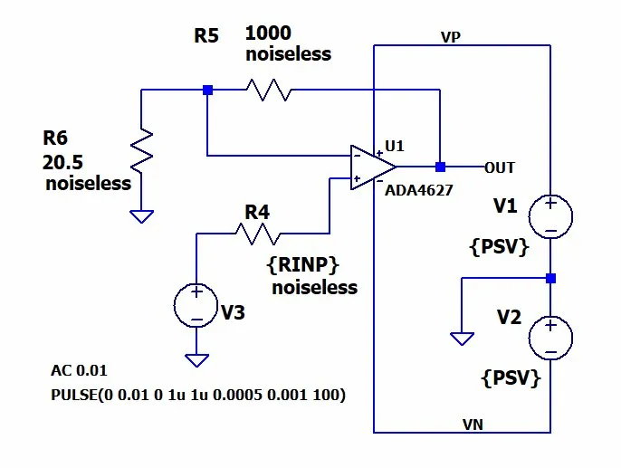

# image2asc

Convert LTspice circuit schematic screenshots into `.asc` files using local AI models.

Uses a hybrid two-stage pipeline: a vision model (Qwen3-VL 8B) extracts circuit structure from the image, then a text model (Qwen3:14b) refines the output into valid LTspice `.asc` format. A web-based visual editor lets you review and adjust the result before exporting.



## How It Works

```
Screenshot --> Qwen3-VL 8B --> JSON IR --> Qwen3:14b --> .asc draft
                                                           |
                                       Visual Editor (review/adjust)
                                                           |
                                                   Final .asc export
```

1. Upload an LTspice screenshot
2. The vision model identifies components, wires, flags, and SPICE directives
3. The text model generates a syntactically valid `.asc` file
4. Review in the visual editor - drag components, draw wires, edit properties
5. Export the final `.asc` file and open it in LTspice

## Prerequisites

- [Python 3.10+](https://www.python.org/downloads/)
- [Node.js 18+](https://nodejs.org/)
- [Ollama](https://ollama.com/)

### Install Ollama Models

```bash
ollama pull qwen3-vl:8b    # Vision model (~6 GB)
ollama pull qwen3:14b       # Text refinement model (~9 GB)
```

Models run sequentially, so they don't need to fit in VRAM at the same time. Ollama handles swapping automatically.

## Setup

### Backend

```bash
cd backend
pip install -r requirements.txt
```

### Frontend

```bash
cd frontend
npm install
```

## Running

Start both servers in separate terminals:

```bash
# Terminal 1 - Backend (API server)
cd backend
python -m uvicorn main:app --reload --port 8000

# Terminal 2 - Frontend (dev server)
cd frontend
npm run dev
```

Open http://localhost:5173 in your browser.

> If port 8000 is in use, run `kill-port.bat` (Windows) or `kill-port.bat 8000` to free it.

## Usage

1. **Upload** - Click "Upload Image" and select an LTspice screenshot (PNG recommended)
2. **Generate** - Click "Generate" to analyze the image (takes 30-120s depending on hardware)
3. **Edit** - Use the visual editor to fix any issues:
   - **Select mode** - Click components to select, drag to move
   - **Wire mode** - Click two points to draw a wire
   - **Component palette** - Add new components from the sidebar
   - **Property panel** - Edit instance names, values, and rotations
   - **Zoom/Pan** - Scroll to zoom, middle-click drag to pan
   - **Undo/Redo** - Ctrl+Z / Ctrl+Y
4. **Export** - Click "Export .asc" to download the file

## Project Structure

```
image2asc/
  backend/
    main.py                 # FastAPI app
    api/routes.py           # REST endpoints
    services/
      ollama_client.py      # Shared Ollama HTTP client
      vision.py             # Image -> JSON IR (Qwen3-VL 8B)
      refinement.py         # JSON IR -> .asc (Qwen3:14b)
      asc_generator.py      # Deterministic JSON IR -> .asc
      validator.py          # .asc syntax validation
    prompts/                # System prompts for AI models
    tests/                  # 34 backend tests
  frontend/
    src/
      components/           # React UI components
        Editor.tsx          # SVG visual schematic editor
        Toolbar.tsx         # Upload, Generate, Export buttons
        ComponentPalette.tsx# Draggable component sidebar
        PropertyPanel.tsx   # Selected item property editor
        AscPreview.tsx      # Live .asc text preview
        ImagePanel.tsx      # Source image display
      hooks/                # State management
        useSchematic.ts     # Schematic CRUD operations
        useHistory.ts       # Undo/redo stack
      lib/                  # Utilities
        api.ts              # Backend API client
        ascGenerator.ts     # Client-side .asc generation
        gridSnap.ts         # LTspice grid snapping (16px)
      types/schematic.ts    # TypeScript type definitions
  dictionary/
    components.json         # 13 LTspice component definitions
    directives.json         # 12 SPICE directive definitions
```

## API Endpoints

| Method | Endpoint | Description |
|--------|----------|-------------|
| GET | `/api/health` | Health check |
| GET | `/api/dictionary` | Component and directive definitions |
| POST | `/api/generate` | Upload image, get JSON IR + .asc draft |
| POST | `/api/refine` | Convert edited JSON IR to .asc |
| POST | `/api/validate` | Validate .asc syntax |

## Supported Components

| Category | Components |
|----------|-----------|
| Passive | Resistor, Capacitor, Inductor |
| Sources | Voltage Source, Current Source |
| Amplifiers | Op-Amp, Op-Amp (2-input) |
| Semiconductors | NPN, PNP, NMOS, PMOS, Diode, Zener |

## Running Tests

```bash
# Backend tests (34 tests)
cd backend
python -m pytest tests/ -v

# Frontend build check
cd frontend
npm run build
```

## Troubleshooting

**Port 8000 in use** - Run `kill-port.bat` to free it.

**Timeout errors** - The first model call is slow (loading into VRAM). Increase the timeout in `backend/services/ollama_client.py` from `300.0` to `600.0` if needed.

**Model not found** - Make sure you've pulled both models with `ollama pull`.

**CORS errors** - Make sure the backend is running on port 8000 and frontend on port 5173.

## Hardware Requirements

- **Minimum**: 8 GB VRAM GPU (models run at Q4 quantization)
- **Recommended**: 12+ GB VRAM for faster inference
- Models use ~6 GB VRAM each but run sequentially, not simultaneously
