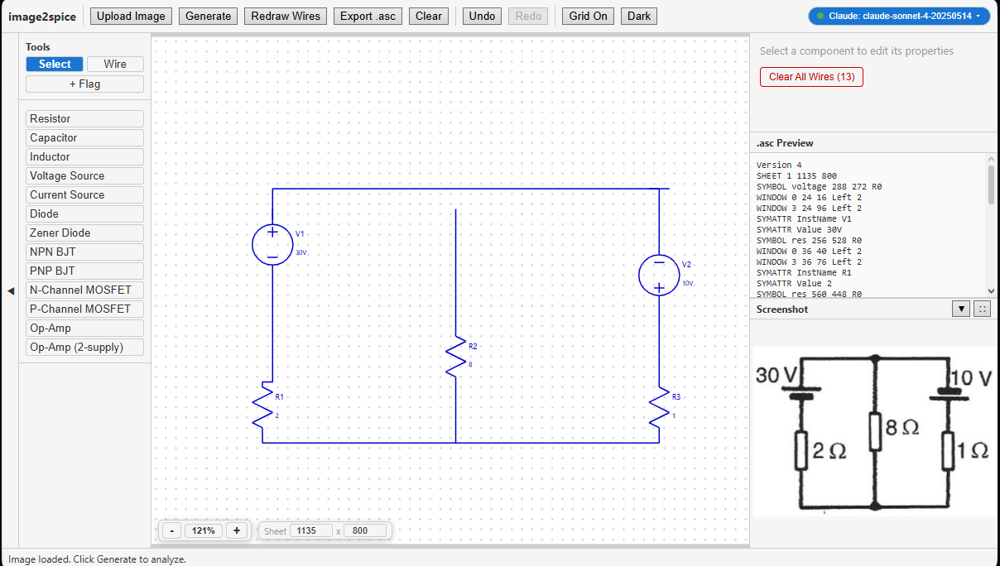
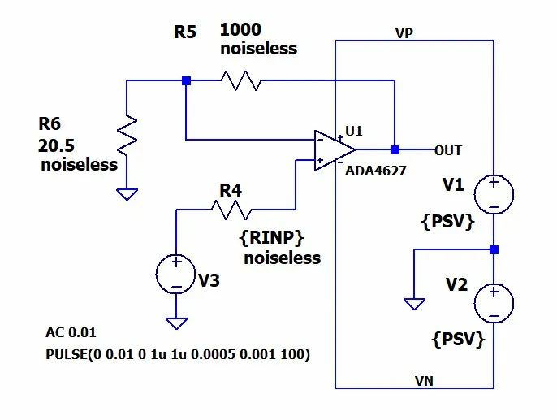

# image2spice

Convert LTspice circuit schematic screenshots into `.asc` files using a vision model and a multi-step wizard pipeline. Supports local inference via [Ollama](https://ollama.com/) or cloud inference via [OpenRouter](https://openrouter.ai/), [OpenAI](https://platform.openai.com/), or [Claude](https://console.anthropic.com/).



## First-Time Setup

### 1. Install Python 3.10+

Check if you already have it:

```bash
python --version
```

If not installed:

| Platform | Command |
|----------|---------|
| **Windows** | Download from [python.org/downloads](https://www.python.org/downloads/) — check **"Add Python to PATH"** during install |
| **macOS** | `brew install python` |
| **Ubuntu/Debian** | `sudo apt update && sudo apt install python3 python3-pip python3-venv` |
| **Fedora** | `sudo dnf install python3 python3-pip` |
| **Arch** | `sudo pacman -S python python-pip` |

### 2. Install Node.js 18+

Check if you already have it:

```bash
node --version
```

If not installed:

| Platform | Command |
|----------|---------|
| **Windows** | Download the LTS installer from [nodejs.org](https://nodejs.org/) |
| **macOS** | `brew install node` |
| **Ubuntu/Debian** | `curl -fsSL https://deb.nodesource.com/setup_lts.x \| sudo -E bash - && sudo apt install -y nodejs` |
| **Fedora** | `sudo dnf install nodejs` |
| **Arch** | `sudo pacman -S nodejs npm` |

### 3. Choose a vision provider

Pick at least one:

| Provider | Setup | Cost |
|----------|-------|------|
| **[Ollama](https://ollama.com/)** (local) | Install Ollama, then: `ollama pull qwen3-vl:8b` | Free (requires 8 GB+ VRAM GPU) |
| **[OpenRouter](https://openrouter.ai/)** (cloud) | Sign up and get an API key | Free tier available |
| **[OpenAI](https://platform.openai.com/)** (cloud) | Sign up and get an API key | Paid |
| **[Claude](https://console.anthropic.com/)** (cloud) | Sign up and get an API key | Paid |

### 4. Clone and install dependencies

```bash
git clone https://github.com/EndryuN/Image2Spice.git
cd Image2Spice

# Backend
cd backend
pip install -r requirements.txt
cd ..

# Frontend
cd frontend
npm install
cd ..
```

### 5. (Optional) Set up API keys

You can provide API keys in **either** of two ways — pick whichever you prefer:

- **In the app:** click the provider status indicator in the toolbar and paste your key directly. Keys live in browser memory only and are never stored on disk.
- **Via `.env` file:** copy the template and fill in one or more keys:

```bash
# Linux / macOS
cp .env.example .env

# Windows (cmd)
copy .env.example .env
```

```
OPENAI_API_KEY=
CLAUDE_API_KEY=
OPENROUTER_API_KEY=
```

If you only use **local Ollama**, you don't need any API keys — skip this step entirely.

### 6. (Linux/macOS only) Make the launcher executable

```bash
chmod +x start.sh
```

You're ready to run the app.

---

## How It Works

```
Image -> Wizard (4 vision-model steps) -> SchematicIR -> deterministic generator -> .asc
                                                |
                                       SVG visual editor (review/adjust)
                                                |
                                          Export .asc
```

1. Upload an LTspice screenshot
2. The wizard runs four vision-model steps: **Identify** components, read **Directives**, describe **Layout**, trace **Wires**
3. A deterministic generator converts the intermediate representation to `.asc`
4. Review and adjust in the visual editor — drag components, draw wires, edit properties
5. Export the final `.asc` file and open it in LTspice



---

## Quick Start (TL;DR)

If you've already done first-time setup:

| Windows | Linux / macOS |
|---------|---------------|
| `start.bat` | `./start.sh` |

Both commands open one terminal, start backend + frontend, and open the app in your browser at `http://localhost:5173`. Click the red **Exit** button in the toolbar to stop everything cleanly. `Ctrl+C` in the terminal also works.

---

## Running the App

The launcher scripts (`start.bat` / `start.sh`) handle everything automatically:

1. **Check dependencies** — verifies Python and Node.js are installed; exits with install instructions if not
2. **Auto-install packages** — runs `pip install` / `npm install` if backend or frontend dependencies are missing
3. **Check Ollama** — warns if Ollama isn't running (not required for cloud providers)
4. **Free ports** — kills any existing processes on ports 8000 and 5173
5. **Start backend** — launches the FastAPI server on port 8000
6. **Start frontend** — launches the Vite dev server on port 5173
7. **Open browser** — opens `http://localhost:5173` automatically
8. **Watch for exit** — monitors the backend; when it stops (via Exit button or Ctrl+C), tears down the frontend too

### Windows

```bash
start.bat
```

### Linux / macOS

```bash
./start.sh
```

Both run in a **single terminal** with interleaved logs. To stop: click the red **Exit** button in the toolbar, or press `Ctrl+C`.

### Manual (two terminals — for active development)

Use this when you want backend hot-reload via `--reload`:

```bash
# Terminal 1 — backend with auto-reload
cd backend
python -m uvicorn main:app --reload --port 8000

# Terminal 2 — frontend dev server
cd frontend
npm run dev
```

Open `http://localhost:5173` in your browser. Press `Ctrl+C` in each terminal to stop.

---

## Stopping the App

Three ways to stop image2spice cleanly:

1. **In-app Exit button** — click the red **Exit** in the toolbar. The frontend calls `/api/shutdown`, the backend exits gracefully, and the launcher script tears down the frontend.
2. **Ctrl+C in the launcher terminal** — works for both `start.bat` and `start.sh`. Both servers tear down.
3. **Manual fallback** — if something gets wedged, run the port-killer:
   - **Windows:** the kill loop is built into `start.bat`'s preamble — just rerun it.
   - **Linux/macOS:** `lsof -ti:8000 | xargs kill -9 ; lsof -ti:5173 | xargs kill -9`

---

## Usage

1. **Choose provider** — Click the status indicator in the toolbar to switch between Local (Ollama), OpenRouter, OpenAI, or Claude. For cloud providers, paste your API key (or it'll be auto-loaded from `.env`).
2. **Upload** — Click **Upload Image** and select an LTspice screenshot (PNG recommended).
3. **Generate** — Click **Generate** to run the four-step wizard. Takes 30–120 s depending on provider and hardware.
4. **Edit** — Use the visual editor:
   - **Select mode** — click components to select, drag to move
   - **Wire mode** — click two points to draw a wire
   - **Component palette** — add new components from the sidebar
   - **Property panel** — edit instance names, values, rotations
   - **Zoom/Pan** — scroll to zoom, middle-click drag to pan
   - **Undo/Redo** — `Ctrl+Z` / `Ctrl+Y`
5. **Export** — Click **Export .asc** to download the file. Open it in LTspice.
6. **Exit** — Click the red **Exit** button when done; the launcher will stop both servers.

---

## Configuration & Providers

Image2spice supports four vision providers. You can configure them either by editing `.env` (loaded once at backend startup) or by pasting an API key directly into the **LLM Status** widget in the toolbar (lives in browser memory only).

| Provider | `.env` key | Hardware | Cost |
|----------|-----------|----------|------|
| **Ollama (local)** | n/a | 8 GB+ VRAM GPU | Free |
| **OpenRouter** | `OPENROUTER_API_KEY` | None | Free tier available |
| **OpenAI** | `OPENAI_API_KEY` | None | Paid |
| **Claude** | `CLAUDE_API_KEY` | None | Paid |

**Recommended models:**
- **Ollama:** `qwen3-vl:8b` (~6 GB on disk)
- **OpenRouter:** `google/gemma-4-26b-a4b-it:free` (auto-fallback to other free models on rate-limit)
- **OpenAI:** `gpt-4o` or `gpt-4o-mini`
- **Claude:** `claude-sonnet-4-5` or `claude-opus-4-6`

---

## Project Structure

```
image2spice/
  backend/
    main.py                    # FastAPI app, CORS for localhost:5173
    api/
      routes.py                # /api/health, /api/dictionary, /api/refine,
                               # /api/validate, /api/env-keys, /api/llm-status,
                               # /api/shutdown
      wizard_routes.py         # /api/wizard/{identify,directives,layout,wires}
    services/
      ollama_client.py         # Shared Ollama HTTP client
      llm_client.py            # Unified vision client (Ollama / OpenRouter / OpenAI / Claude)
      vision.py                # Wizard vision calls
      asc_generator.py         # Deterministic SchematicIR -> .asc
      asy_parser.py            # .asy file parser
      layout.py                # Spatial -> grid coordinates (16 px snap)
      wire_router.py           # Wire description -> coordinate segments
      validator.py             # .asc syntax validation
    prompts/                   # System prompts (one per wizard step)
    scripts/
      rebuild_dictionary.py    # Regenerate dictionary/components.json from .asy files
    tests/                     # pytest test files
  frontend/
    src/
      App.tsx                  # Root component, layout, wizard orchestration
      components/
        Editor.tsx             # SVG schematic editor (select/wire modes)
        Toolbar.tsx            # Upload, Generate, Export, Undo/Redo, Grid, Theme, Exit
        ComponentPalette.tsx   # Draggable component sidebar
        PropertyPanel.tsx      # Selected item property editor
        AscPreview.tsx         # Live .asc text preview
        ScreenshotPanel.tsx    # Source image display
        GenerateWizard.tsx     # Step-by-step generation modal
        LlmStatus.tsx          # Provider switcher
        StoppedScreen.tsx      # Shown after Exit button is pressed
      hooks/                   # useSchematic, useHistory, useTheme
      lib/
        api.ts                 # Backend API client (includes apiShutdown)
        ascGenerator.ts        # Client-side .asc generation
        gridSnap.ts            # 16 px LTspice grid snapping
      types/schematic.ts       # TypeScript types
      styles/theme.css         # CSS custom properties (light + dark)
  dictionary/
    components.json            # 13 LTspice component definitions (from .asy files)
    directives.json            # SPICE directive definitions
  ground truth/
    source/                    # Test input images (.png, .jpg, .svg)
    output/                    # Reference .asc files
  start.bat                    # Windows launcher (single terminal)
  start.sh                     # Linux/macOS launcher (single terminal)
  .env.example                 # Provider key template (copy to .env)
```

---

## API Endpoints

| Method | Endpoint | Description |
|--------|----------|-------------|
| GET | `/api/health` | Health check |
| GET | `/api/env-keys` | Which providers have keys configured in `.env` |
| GET | `/api/llm-status` | Check provider connectivity |
| GET | `/api/dictionary` | Component + directive definitions |
| POST | `/api/refine` | Convert JSON IR to `.asc` (deterministic) |
| POST | `/api/validate` | Validate `.asc` syntax |
| POST | `/api/wizard/identify` | Vision: list components from image |
| POST | `/api/wizard/directives` | Vision: read SPICE directives |
| POST | `/api/wizard/layout` | Vision: spatial layout → grid coordinates |
| POST | `/api/wizard/wires` | Vision: connections → wire segments |
| POST | `/api/shutdown` | Gracefully stop the backend (used by Exit button) |

Wizard endpoints accept `multipart/form-data` with `file` (image) and optional JSON form fields.

---

## Supported Components

| Category | Components |
|----------|-----------|
| Passive | Resistor, Capacitor, Inductor |
| Sources | Voltage Source, Current Source |
| Amplifiers | Op-Amp, Op-Amp (2-input) |
| Semiconductors | NPN, PNP, NMOS, PMOS, Diode, Zener |

---

## Tests

```bash
# Backend tests
cd backend
python -m pytest tests/ -v

# Frontend build check (no automated tests — convention)
cd frontend
npm run build
```

Tests that call vision endpoints are mocked — no live Ollama or OpenRouter needed for the test suite.

---

## Troubleshooting

**Ollama must be running** (local mode only) — Start `ollama serve` before the backend. Wizard endpoints will return `500` if Ollama is unreachable. The launcher scripts warn you if Ollama isn't up but continue anyway, since cloud providers don't need it.

**OpenRouter rate limits** — Free-tier models have rate limits. The app retries with backoff and falls back to alternative free models automatically.

**Port conflicts** — Both `start.bat` and `start.sh` kill anything listening on ports 8000 and 5173 in their preamble.

**Timeout errors** — The first Ollama call is slow because the model loads into VRAM. Local timeout is 600 s, OpenRouter timeout is 120 s.

**CORS errors** — Backend only allows `http://localhost:5173`. If the frontend port changes, update `backend/main.py`.

**Exit button does nothing** — Check the cmd window / terminal for errors. The button calls `POST /api/shutdown`; if the backend is already down, the frontend still shows the "stopped" screen.

**Frontend keeps running after `Ctrl+C`** — That should not happen — the watcher loop in `start.bat` and the trap in `start.sh` both kill the frontend on backend death. If you see this, please open an issue with your OS and the launcher's output.

**Dictionary rebuild requires LTspice installed** — Run `python scripts/rebuild_dictionary.py` from `backend/`. LTspice symbol files live at `%LOCALAPPDATA%\LTspice\lib\sym\` on Windows.

---

## Hardware Requirements

**Local (Ollama):**
- **Minimum:** 8 GB VRAM GPU (model runs at Q4 quantization)
- **Recommended:** 12+ GB VRAM for faster inference
- Only one model (~6 GB VRAM) is loaded at runtime

**Cloud (OpenRouter / OpenAI / Claude):**
- No GPU required — runs entirely in the cloud
- OpenRouter has a free tier; OpenAI and Claude are pay-per-use

---

## Future: Deploy Your Own

A rough sketch for hosting image2spice on a public URL with per-session isolation lives in the design doc at `docs/superpowers/specs/2026-04-12-deploy-and-readme-design.md` (§11). The backend is already mostly stateless, so the path forward is: static frontend on Cloudflare Pages or Vercel, FastAPI backend on Fly.io or Render, vision provider via the user's own pasted API key. Not implemented yet — contributions welcome.
